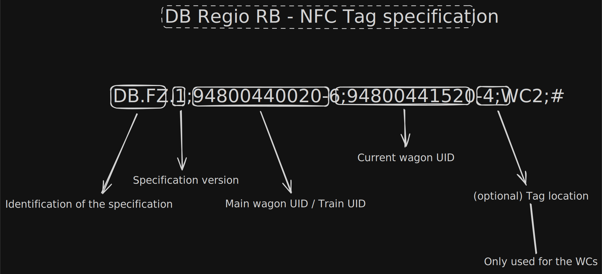

# Research

This is my own research using (mostly) my phone (using NFC Tools). Credits also go to [@anonymos3584](https://github.com/anonymos3584) for helping me with the identification and research deep dive.

## 17.01.2026 - DB Regio RB (Baden Württemberg)

Method: Raw reading

Raw NFC data read from the tag: `2026-01-17-RB.nfc` (file)

Tag location: Toilet lamp on the bottom (marked with an NFC symbol)

Reading: `DB.FZ.1;94800440027-1;94800441027-0;WC1;#`

Wagon identifier: `94 80 0441027-0 D-DB`


### String decoding

```
DB.FZ.1;94800440027-1;94800441027-0;WC1;#
 |  | |     |               |        |
 |  | |     |               |       Tag location (optional)
 |  | |     |               |
 |  | |     |               |
 |  | |     |            Wagon identifier (94800441027-0)
 |  | |     |
 |  | | Train identifier (?) - Needs more research
 |  | Indentifier version (very likely)
 | Likely the shortening of "Fahrzeug" or vehicle in German
Provider
```

## 19.01.2026 - DB Regio RB (Baden Württemberg)

### Meta Infos

Method: Raw reading

Raw NFC data read from the tag: `2026-01-19_01.nfc` (file), `2026-01-19_02.nfc` (file), `2026-01-19_02-WC2.nfc` (file)

### Tag locations
1. Information panel next to the door in the first wagon
2. Information panel next to the door in the second wagon
3. Toilet lamp in the second wagon

### Readings
1. `DB.FZ.1;94800440020-6;94800440520-5;;#`
2. `DB.FZ.1;94800440020-6;94800441520-4;;#`
3. `DB.FZ.1;94800440020-6;94800441520-4;WC2;#` 

### Asumptions
 - The first identifier doesn't correspond to the first wagon, as it has an different wagon identifier printed on the outside and set on the tag.
 - The second identifier corresponds to the wagon identifier that is also printed on the outside. It was replicated through the scans in different wagons with the checking of the printed wagon identifier.
 - The location identifier is not consistently available on all tags. It only appeared in toilet locations so far. The tags in door areas don't use it.
 - The train identifier is still unknown. It could be a train number, but more research is needed to confirm this. It could also be assumed that it could be associated with an internal DB system.
 - The version identifier is consistent across all tags so far, indicating that it might be a versioning system for the tag format or data structure. At the moment, it is always `1`.
 - The provider identifier is consistently `DB.FZ`, indicating that it is likely a standard format used by Deutsche Bahn for their vehicle tags.
 - For further research, the raw readings are all provided in the files mentioned in this document. Those are useable using the Flipper Zero NFC app, and can be converted to other formats if needed using open-source tools.

## 20.01.2026 - DB Regio RB (Baden Württemberg)

### Meta Infos

Method: Raw reading

Raw NFC files: `2026-01-20/`

### Readings

1. Wagon 3 (file: `W3-WC2.nfc`)
`DB.FZ.1;94800440020-6;94800441520-4;WC2;#`

2. Wagon 3 (file: `W3.nfc`)
`DB.FZ.1;94800440020-6;94800441520-4;;#`

3. Wagon 2 (file: `W2.nfc`)
`DB.FZ.1;94800440020-6;94800441020-5;;#`

4. Wagon 1 (file: `W1.nfc`)
`DB.FZ.1;94800440020-6;;;#`

5. Wagon 4 (file: `W4.nfc`)
`DB.FZ.1;94800440020-6;94800440520-5;;#`

### Conclusions

Since the train had 4 wagons (and I had enough time left till departure and the masses of people came), I scanned all tags in the door locations. The only tag I scanned outside of that are was in the WC of the third wagon.

These were the conclusions I found using those scans:
1. There are indeed wagons that have the UID that's given in the first UID parameter. It seems that they are the "main wagon".
2. Only *one UID* has to be given in the format. It seem's that the other parameters *can be* optional. It can be assumed that the specification *only allows one tag* that disregards the second UID. As far as research goes, the tag location parameter ("WC1" and "WC2") are optional.
3. As far as the current standing of knowledge is, the format specification seems to be consistent over different RB trains.

### Information gathering

Thank you goes out to Bwegt, and their two helpful ladies at my local Bwegt center. I asked one of them about it, and she said, that she thinks those are for the train operators to log their current working train over an internal app using their work phones.

The other lady that jumped in into our conversation said that it's for an internal app (maybe the same one) to report damages. In this case, the tags help to report the incident location. That explanation would be one of the best ones I got from people indirectly involved (they are only working in the ticketing service), and inside the train community.

I'm currently also search for a way to get into official email contact with DB, so I can get an direct answer from the train provider.

### Updated layout

